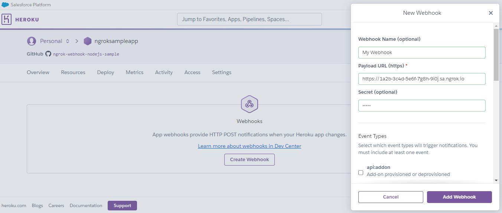
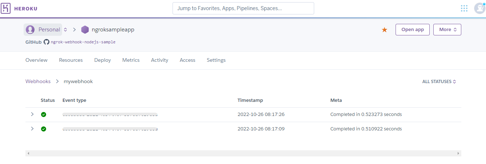
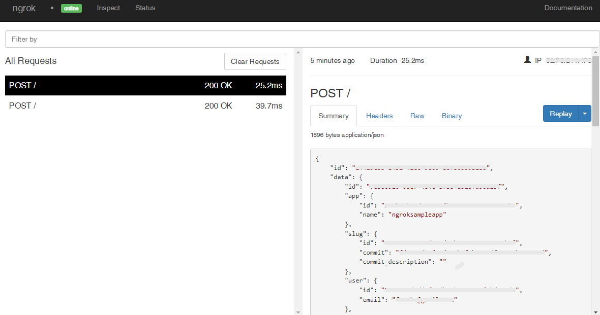

# Heroku Webhooks
------------

:::tip TL;DR

To integrate Heroku webhooks with ngrok:
1. [Launch your local webhook.](#start-your-app) `npm start`
1. [Launch ngrok.](#start-ngrok) `ngrok http 3000`
1. [Configure Heroku webhooks with your ngrok URL.](#setup-webhook)
1. **Bonus!** [Use ngrok like a PRO.](#security)

:::


This guide covers how to use ngrok to integrate your localhost app with Heroku by using Webhooks.
Heroku webhooks can be used to notify an external application whenever specific events occur in your Heroku account. 

By integrating ngrok with Heroku, you can:

- **Develop and test Heroku webhooks locally**, eliminating the time in deploying your development code to a public environment and setting it up in HTTPS.
- **Inspect and troubleshoot requests from Heroku** in real-time via the inspection UI and API.
- **Modify and Replay Heroku Webhook requests** with a single click and without spending time reproducing events manually in your Heroku account.
- **Secure your app with Heroku validation provided by ngrok**. Invalid requests are blocked by ngrok before reaching your app.


## **Step 1**: Start your app {#start-your-app}

For this tutorial, we'll use the [sample NodeJS app available on GitHub](https://github.com/ngrok/ngrok-webhook-nodejs-sample). 

To install this sample, run the following commands in a terminal:

```bash
git clone https://github.com/ngrok/ngrok-webhook-nodejs-sample.git
cd ngrok-webhook-nodejs-sample
npm install
```

This will get the project installed locally.

Now you can launch the app by running the following command: 

```bash
npm start
```

The app runs by default on port 3000. 

You can validate that the app is up and running by visiting http://localhost:3000. The application logs request headers and body in the terminal and responds with a message in the browser.


## **Step 2**: Launch ngrok {#start-ngrok}

Once your app is running successfully on localhost, let's get it on the internet securely using ngrok! 

1. If you're not an ngrok user yet, just [sign up for ngrok for free](https://ngrok.com/signup).

1. [Download the ngrok agent](https://ngrok.com/download).

1. Go to the [ngrok dashboard](https://dashboard.ngrok.com) and copy your Authtoken. <br />
    **Tip:** The ngrok agent uses the auth token to log into your account when you start a tunnel.
    
1. Start ngrok by running the following command:
    ```bash
    ngrok http 3000
    ```

1. ngrok will display a URL where your localhost application is exposed to the internet (copy this URL for use with Heroku).
    


## **Step 3**: Integrate Heroku {#setup-webhook}

To register a webhook on your Heroku account follow the instructions below:

1. Access [Heroku](https://heroku.com/) and sign in using your Heroku account.

1. On the Dashboard page, click the name of a app from the **Personal** app list.
    **Tip:** If you don't have an app, create a new one by clicking **New** and then clicking **Create new app**.

1. On your app's page, click **More**, click **View Webhooks**, and then click **Create Webhook**.

1. On the **New Webhook** popup, enter a name in the **Webhook Name** field and enter the URL provided by the ngrok agent to expose your application to the internet in the **Payload URL** field (i.e. `https://1a2b-3c4d-5e6f-7g8h-9i0j.sa.ngrok.io`).
    

1. Enter a `12345` in the **Secret** field, click the **api:app** and the **api:build** checkboxes under the **Event Types** section, and then click **Add Webhook**:


### Run Webhooks with Heroku and ngrok

Heroku sends different request body contents depending on the event that is being triggered.
You can trigger a call from Heroku to your application by following the instructions below:

1. Access [Heroku](https://heroku.com/) and sign in using your Heroku account.

1. On the Dashboard page, click your app name, click the **Deploy** tab, scroll down to the **Manual deploy** section, select a branch to deploy, and then click **Deploy Branch**.

    After the deployment finishes, confirm your localhost app receives a notification and logs both headers and body in the terminal.

Optionally, you can verify the log of the webhook call on your Heroku's page:

1. On the Dashboard page, click your app name, click **More**, click **View Webhooks**, and then click the name of your webhook on the list of webhooks.

    


### Inspecting requests

When you launch the ngrok agent on your local machine, you can see two links: one for the tunnel to your app (it ends up in `ngrok.io` unless you're using custom domains) and a local URL for the Web Interface (a.k.a **Request Inspector**).

The Request Inspector shows all the requests made through your ngrok tunnel to your localhost app. When you click on a request, you can see details of both the request and the response.

Seeing requests is an excellent way of validating the data sent to and retrieved by your app via the ngrok tunnel. That alone can save you some time dissecting and logging HTTP request and response headers, methods, bodies, and response codes within your app just to confirm you are getting what you expect.

To inspect Heroku's webhooks call, launch the ngrok web interface (i.e. `http://127.0.0.1:4040`) and then click one of the requests sent by Heroku.

From the results, review the response body, header, and other details:




### Replaying requests

The ngrok Request Inspector provides a replay function that you can use to test your code without the need to trigger new events from Heroku. To replay a request:

1. In the ngrok inspection interface (i.e. `http://localhost:4040`), select a request from Heroku.

1. Click **Replay** to execute the same request to your application or select **Replay with modifications** to modify the content of the original request before sending the request.

1. If you choose to **Replay with modifications**, you can modify any content from the original request. For example, you can modify the **id** field inside the body of the request.

1. Click **Replay**.

Verify that your local application receives the request and logs the corresponding information to the terminal.


## **Bonus**: Secure webhook requests {#security}

The ngrok signature webhook verification feature allows ngrok to assert that requests from your Heroku webhook are the only traffic allowed to make calls to your localhost app.

**Note:** This ngrok feature requires a Pro or Enterprise license.

This is a quick step to add extra protection to your application.

1. Restart your ngrok agent by running the command, replacing `{your webhook secret}` with the value you have entered in the **Secret** field during the webhook registration (See [Integrate ngrok and Heroku.](#setup-webhook)):
    ```bash
    ngrok http 3000 --verify-webhook+HEROKU --verify-webhook-secret={your webhook secret}
    ```

1. Access [Heroku](https://heroku.com/), sign in using your Heroku account, access your app, and then execute a new build.

Verify that your local application receives the request and logs information to the terminal.
