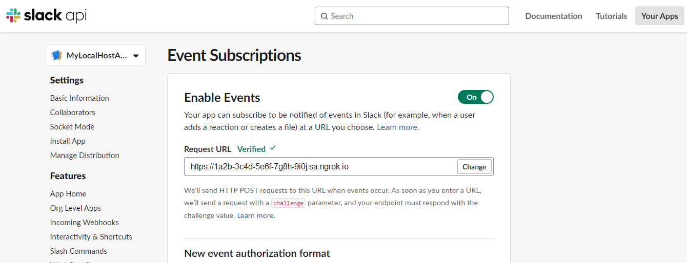
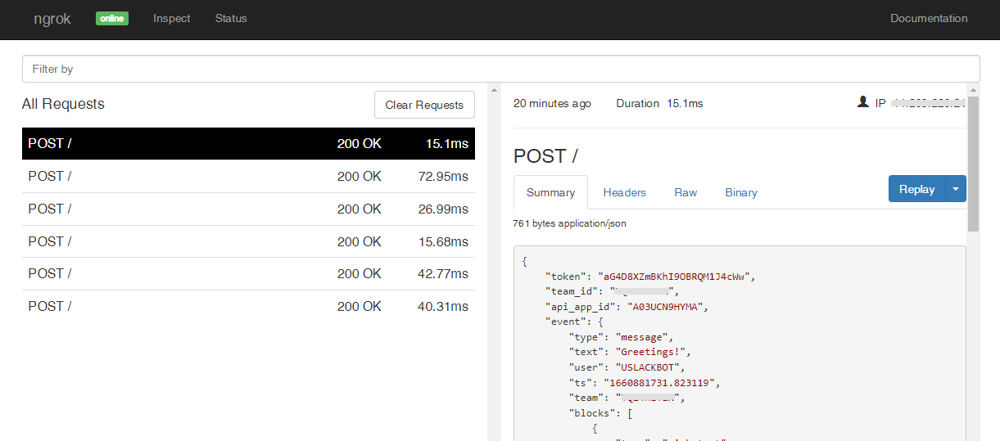

# Slack Webhook
------------

:::tip TL;DR

To integrate Slack webhooks with ngrok:
1. [Launch your local webhook.](#start-your-app) `npm start`
1. [Launch ngrok.](#start-ngrok) `ngrok http 3000`
1. [Configure Slack webhooks with your ngrok URL.](#setup-webhook)
1. **Bonus!** [Use ngrok like a PRO.](#security)

:::


This guide covers how to use ngrok to integrate your localhost app with Slack using Webhooks.
Slack webhooks can be used to notify an external application whenever specific events occur in your Slack account. 
Slack requires your application to be available through an HTTPS endpoint.

By integrating ngrok with Slack, you can:

- **Develop and test Slack webhooks locally**, eliminating the time in deploying your development code to a public environment and setting it up in HTTPS.
- **Inspect and troubleshoot requests from Slack** in real-time via the inspection UI and API.
- **Modify and Replay Slack Webhook requests** with a single click and without spending time reproducing events manually in your Slack account.
- **Secure your app with Slack validation provided by ngrok**. Invalid requests are blocked by ngrok before reaching your app.


## **Step 1**: Start your app {#start-your-app}

For this tutorial, we'll use the [sample NodeJS app available on GitHub](https://github.com/ngrok/ngrok-webhook-nodejs-sample). 

To install this sample, run the following commands in a terminal:

```bash
git clone https://github.com/ngrok/ngrok-webhook-nodejs-sample.git
cd ngrok-webhook-nodejs-sample
npm install
```

This will get the project installed locally.

Now you can launch the app by running the following command: 
`npm run startSlack`

The app runs by default on port 3000. 

You can validate that the app is up and running by visiting http://localhost:3000. The application logs request headers and body in the terminal and a message in the browser.


## **Step 2**: Launch ngrok {#start-ngrok}

Once your app runs successfully on localhost, let's get it on the internet securely using ngrok! 

1. If you're not an ngrok user yet, just [sign up for ngrok for free](https://ngrok.com/signup).

1. [Download the ngrok agent](https://ngrok.com/download).

1. Go to the [ngrok dashboard](https://dashboard.ngrok.com) and copy your Authtoken.
    **Tip:** The ngrok agent uses the auth token to log into your account when you start a tunnel.
    
1. Start ngrok by running the following command:
    ```bash
    ngrok http 3000
    ```

1. ngrok will display a URL where your localhost application is exposed to the internet (copy this URL for use with Slack).
    


## **Step 3**: Integrate  Slack {#setup-webhook}

To register a webhook with your Slack account, follow the instructions below:

1. Access the [Slack Web app](https://app.slack.com/) and sign in using your Slack account.
    **Tip**: There is no need to open the slack app on your desktop for now. Continue with the **use Slack in your browser** option.

1. In the same browser tab, access the [Slack API portal](https://api.slack.com/apps) and then click **Create an App**.
    **Tip**: If you already have some apps created, click ****.

1. In the **Create an app** window, click **From scratch**, provide the **App Name**, select a workspace under **Pick a workspace to develop your app in**, and then click **Create App**.

1. In the **Basic Information** page, expand **Add features and functionality** and then click **Event Subscriptions**.

1. In the **Event Subscriptions** page, click the **Enable Events** slider to turn it on. In the **Request URL** field, enter the URL provided by the ngrok agent to expose your application to the internet (i.e., `https://1a2b-3c4d-5e6f-7g8h-9i0j.sa.ngrok.io`).
    

    **Note**: Slack makes a one-time call to your app. It sends a challenge parameter as part of the request body and expects the app to respond with this value.

1. On the same page, expand **Subscribe to events on behalf of users**, click **Add Workspace Event**, select `message.im`, and then click **Save Changes**.
    **Tip**: More about Slack event types [here](https://api.slack.com/events).

1. In the left menu, click **Install App**, click **Install to Workspace**, and then click **Allow** to allow your application to access your workspace.


### Run Webhooks with Slack and ngrok

Because you've subscribed to the `message.im` event and installed your app to your slack workspace, you now can direct message any person in the workspace to make Slack call your localhost application:

1. Access the [Slack Web app](https://app.slack.com/) or open the slack app on your desktop, and verify that your application appears under **Apps** in the left menu.

1. Select one person in your workspace and send the person a message. Alternatively, you can select the **Slackbot**,  write `Hello Slack bot!` in the message field, and then send it.

Confirm your localhost app receives notifications about the message.

**Tip:** Slack sends different request body contents and headers depending on the trigger event.


### Inspecting requests

When you launch the ngrok agent on your local machine, you can see two links: one for the tunnel to your app (it ends up in `ngrok.io` unless you're using custom domains) and a local URL for the Web Interface (a.k.a **Request Inspector**).

The Request Inspector shows all the requests made through your ngrok tunnel to your localhost app. When you click on a request, you can see details of both the request and the response.

Seeing requests is an excellent way of validating the data sent to and retrieved by your app via the ngrok tunnel. That alone can save you time dissecting and logging HTTP request and response headers, methods, bodies, and response codes within your app to confirm you are getting what you expect.

To inspect Slack's event requests, launch the ngrok web interface (i.e. `http://127.0.0.1:4040`), and then click one of the requests sent by Slack.



From the results, review the response body, header, and other details:


### Replaying requests

The ngrok Request Inspector provides a replay function that you can use to test your code without the need to trigger new events from Slack. To replay a request:

1. In the ngrok inspection interface (i.e., `http://localhost:4040`), select a request from Slack.

1. Click **Replay** to execute the same request to your application or select **Replay with modifications** to modify the content of the original request before sending the request.

1. If you choose to **Replay with modifications**, you can modify any content from the original request. For example, you can modify the **text** attribute value in the body of the request.

1. Click **Replay**.

Verify that your local application receives the request and logs the corresponding information to the terminal.


## **Bonus**: Secure webhook requests {#security}

The ngrok signature webhook verification feature allows ngrok to assert that requests from your Slack webhook are the only traffic allowed to make calls to your localhost app.

**Note:** This ngrok feature requires a Pro or Enterprise license.

This is a quick step to add extra protection to your application.

1. In the **Basic Information** page for your Slack app, click **Show** for the **Signing Secret** and copy the value that appears.

1. Restart your ngrok agent by running the command, replacing `{your signing secret}` with your **Signing Secret** from Slack:
    `ngrok http 3000 --verify-webhook slack --verify-webhook-secret {your signing secret}`

1. In your Slack app, select the **Slackbot**,  write `Hello Slack bot!` in the message field, and then send it.

Verify that your local application receives the request and logs information to the terminal.


