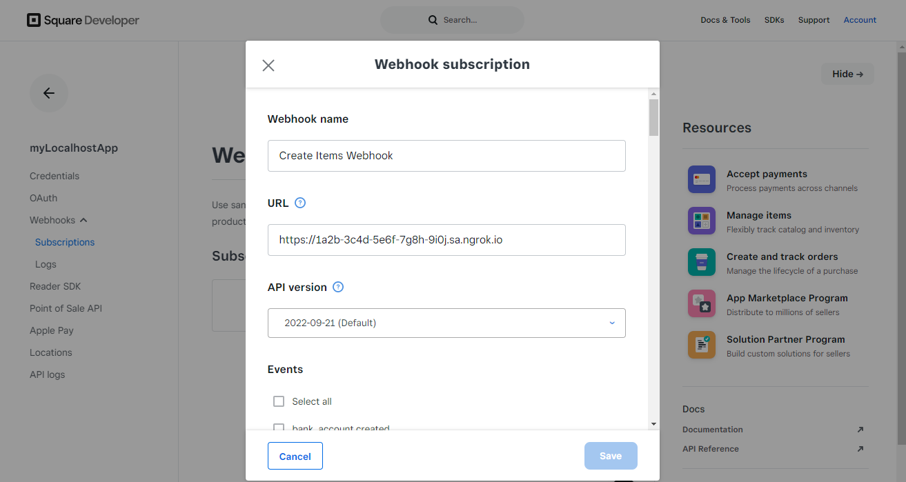
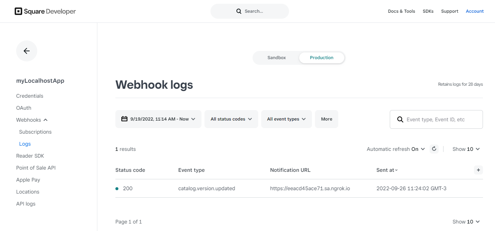
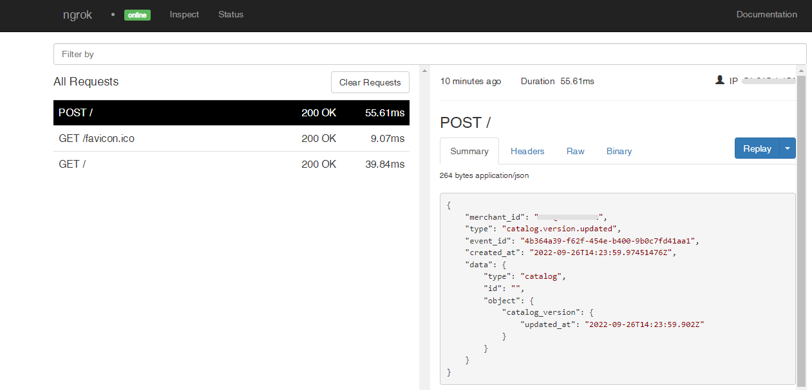

# Square Webhooks
------------

:::tip TL;DR

To integrate Square webhooks with ngrok:
1. [Launch your local webhook.](#start-your-app) `npm start`
1. [Launch ngrok.](#start-ngrok) `ngrok http 3000`
1. [Configure Square webhooks with your ngrok URL.](#setup-webhook)
1. **Bonus!** [Use ngrok like a PRO.](#security)

:::


This guide covers how to use ngrok to integrate your localhost app with Square by using Webhooks.
Square webhooks can be used to notify an external application whenever specific events occur in your Square account. 

By integrating ngrok with Square, you can:

- **Develop and test Square webhooks locally**, eliminating the time in deploying your development code to a public environment and setting it up in HTTPS.
- **Inspect and troubleshoot requests from Square** in real-time via the inspection UI and API.
- **Modify and Replay Square Webhook requests** with a single click and without spending time reproducing events manually in your Square account.
- **Secure your app with Square validation provided by ngrok**. Invalid requests are blocked by ngrok before reaching your app.


## **Step 1**: Start your app {#start-your-app}

For this tutorial, we'll use the [sample NodeJS app available on GitHub](https://github.com/ngrok/ngrok-webhook-nodejs-sample). 

To install this sample, run the following commands in a terminal:

```bash
git clone https://github.com/ngrok/ngrok-webhook-nodejs-sample.git
cd ngrok-webhook-nodejs-sample
npm install
```

This will get the project installed locally.

Now you can launch the app by running the following command: 

```bash
npm start
```

The app runs by default on port 3000. 

You can validate that the app is up and running by visiting http://localhost:3000. The application logs request headers and body in the terminal and responds with a message in the browser.


## **Step 2**: Launch ngrok {#start-ngrok}

Once your app is running successfully on localhost, let's get it on the internet securely using ngrok! 

1. If you're not an ngrok user yet, just [sign up for ngrok for free](https://ngrok.com/signup).

1. [Download the ngrok agent](https://ngrok.com/download).

1. Go to the [ngrok dashboard](https://dashboard.ngrok.com) and copy your Authtoken. <br />
    **Tip:** The ngrok agent uses the auth token to log into your account when you start a tunnel.
    
1. Start ngrok by running the following command:
    ```bash
    ngrok http 3000
    ```

1. ngrok will display a URL where your localhost application is exposed to the internet (copy this URL for use with Square).
    


## **Step 3**: Integrate  Square {#setup-webhook}

To register a webhook on your Square account follow the instructions below:

1. Access the [Square Developer](https://developer.squareup.com/apps) page, and sign in using your Square account.

1. Click the plus sign to add a new application, provide **Application name** as `myLocalhostApp`, click **I agree to the Square Developer Terms of Service**, and then click **Save**.

1. On the **Applications** page, click **Open** in the application tile.

1. On your app page, click **Subscriptions** under the **Webhooks** section of the left menu.

1. In the **Webhook subscriptions** page, click **Production** and then click **Add subscription**.

1. In the **Webhook subscription** popup, provide `Create Items Webhook` as the **Webhook name** and in the **URL** field enter the URL provided by the ngrok agent to expose your application to the internet (i.e. `https://1a2b-3c4d-5e6f-7g8h-9i0j.sa.ngrok.io`).
    

1. In the **Events** section, select **catalog.version.updated** and then click **Save**.


### Run Webhooks with Square and ngrok

Because you've selected the **catalog.version.updated** event, you can trigger new calls from Square to your application by following the instructions below:
Square sends different request body contents depending on the event you select during the webhook registration.

1. In the same browser, access the [Square Dashboard](https://squareup.com/dashboard) page, click **Items & orders**, and then click the **Items** on the left menu.
    **Tip**: Optionally, you can click **Items** under the **Quick access** menu.

1. In the **Your item library** page, click **Create an item**, and then provide **Details** such as **Name**, **Category**, **SKU**, **Price**, and then click **Save**.
    Confirm your localhost app receives the create user event notification and logs both headers and body in the terminal.

1. Optionally, you can access the [Square Dashboard](https://squareup.com/dashboard) page for your application, click **Logs** under **Webhooks** on the left menu, click the last log that appears on the page, and confirm the post request sent by Square is the same as the request logged by the localhost application.
    

### Inspecting requests

When you launch the ngrok agent on your local machine, you can see two links: one for the tunnel to your app (it ends up in `ngrok.io` unless you're using custom domains) and a local URL for the Web Interface (a.k.a **Request Inspector**).

The Request Inspector shows all the requests made through your ngrok tunnel to your localhost app. When you click on a request, you can see details of both the request and the response.

Seeing requests is an excellent way of validating the data sent to and retrieved by your app via the ngrok tunnel. That alone can save you some time dissecting and logging HTTP request and response headers, methods, bodies, and response codes within your app just to confirm you are getting what you expect.

To inspect Square's webhooks call, launch the ngrok web interface (i.e. `http://127.0.0.1:4040`), and then click one of the requests sent by Square.

From the results, review the response body, header, and other details:




### Replaying requests

The ngrok Request Inspector provides a replay function that you can use to test your code without the need to trigger new events from Square. To replay a request:

1. In the ngrok inspection interface (i.e. `http://localhost:4040`), select a request from Square.

1. Click **Replay** to execute the same request to your application or select **Replay with modifications** to modify the content of the original request before sending the request.

1. If you choose to **Replay with modifications**, you can modify any content from the original request. For example, you can modify the **id** field inside the body of the request.

1. Click **Replay**.

Verify that your local application receives the request and logs the corresponding information to the terminal.


## **Bonus**: Secure webhook requests {#security}

The ngrok signature webhook verification feature allows ngrok to assert that requests from your Square webhook are the only traffic allowed to make calls to your localhost app.

**Note:** This ngrok feature requires a Pro or Enterprise license.

This is a quick step to add extra protection to your application.

1. Access the [Square Developer](https://developer.squareup.com/apps) page, and sign in using your Square account.

1. On the **Applications** page, click **Open** in the application tile.

1. On your application page, scroll down until you find **Access token**, click **Show** for this field, and then copy the **Access token** value.
    **Tip**: Depending on the environment you choose the name of the field is either **Sandbox Access token** or **Production Access token**.

1. Restart your ngrok agent by running the command, replacing `{your access token}` with the value you copied before:
    ```bash
    ngrok http 3000 --verify-webhook square --verify-webhook-secret {your access token}
    ```

1. Access the [Square Dashboard](https://squareup.com/dashboard/) page and create a new item.

Verify that your local application receives the request and logs information to the terminal.


