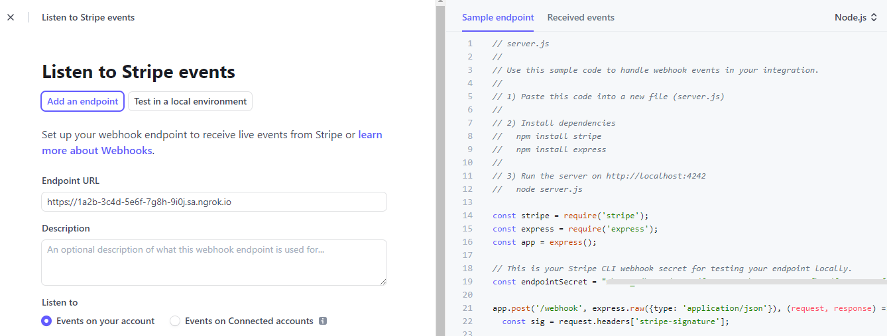
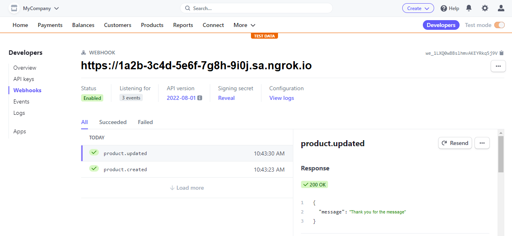
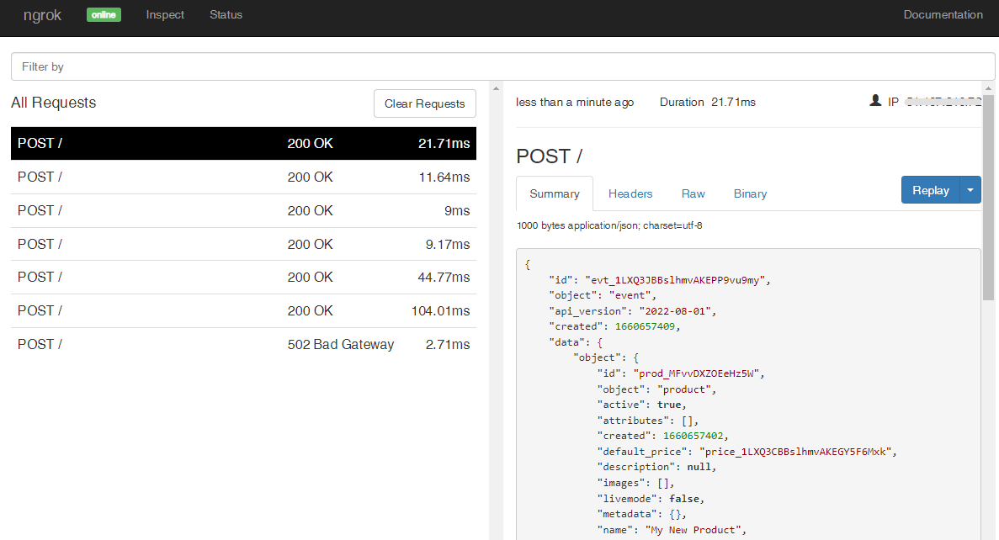

# Stripe Webhook
------------

:::tip TL;DR

To integrate Stripe webhooks with ngrok:
1. [Launch your local webhook.](#start-your-app) `npm start`
1. [Launch ngrok.](#start-ngrok) `ngrok http 3000`
1. [Configure Stripe webhooks with your ngrok URL.](#setup-webhook)
1. **Bonus!** [Use ngrok like a PRO.](#security)

:::


This guide covers how to use ngrok to integrate your localhost app with Stripe webhooks.
Stripe webhooks can be used to notify an external application whenever specific events occur in your Stripe account. Stripe requires your application to be available through an HTTPS endpoint.

By integrating ngrok with Stripe, you can:

- **Develop and test Stripe webhooks locally**, eliminating the time in deploying your development code to a public environment and setting it up in HTTPS.
- **Inspect and troubleshoot requests from Stripe** in real-time via the inspection UI and API.
- **Modify and Replay Stripe Webhook requests** with a single click and without spending time reproducing events manually in your Stripe account.
- **Secure your app with Stripe validation provided by ngrok**. Invalid requests are blocked by ngrok before reaching your app.


## **Step 1**: Start your app {#start-your-app}

For this tutorial, we'll use the [sample NodeJS app available on GitHub](https://github.com/ngrok/ngrok-webhook-nodejs-sample). 

To install this sample, run the following commands in a terminal:

```bash
git clone https://github.com/ngrok/ngrok-webhook-nodejs-sample.git
cd ngrok-webhook-nodejs-sample
npm install
```

This will get the project installed locally.

Now you can launch the app by running the following command: 

```bash
npm start
```

The app runs by default on port 3000. 

You can validate that the app is up and running by visiting http://localhost:3000. The application logs request headers and body in the terminal and a message in the browser.


## **Step 2**: Launch ngrok {#start-ngrok}

Once your app runs successfully on localhost, let's securely get it on the internet using ngrok! 

1. If you're not an ngrok user yet, just [sign up for ngrok for free](https://ngrok.com/signup).

1. [Download the ngrok agent](https://ngrok.com/download).

1. Go to the [ngrok dashboard](https://dashboard.ngrok.com) and copy your Authtoken. <br />
    **Tip:** The ngrok agent uses the auth token to log into your account when you start a tunnel.
    
1. Start ngrok by running the following command:
    ```bash
    ngrok http 3000
    ```

1. ngrok will display a URL where your localhost application is exposed to the internet (copy this URL for use with Stripe).
    


## **Step 3**: Integrate  Stripe {#setup-webhook}


To register a Stripe webhook:

1. Access the [Stripe dashboard](https://dashboard.stripe.com/) and sign in using your Stripe account.

1. Click **Developers** on the top-right corner of the dashboard page, and then click **Webhooks** in the left menu.

1. In the **Webhooks** page, click **Add an endpoint**.

1. On the **Listen to Stripe events** page, in the **Endpoint URL** field, enter the URL provided by the ngrok agent to expose your application to the internet (i.e. `https://1a2b-3c4d-5e6f-7g8h-9i0j.sa.ngrok.io`).
    

1. Click **+ Select events**. 

1. Select the events you want to receive notifications. For this tutorial, expand **Product** and then click **Select all Product events**.
    **Tip**: During the webhook registration, Stripe provides you with a sample code that you can use to deploy and run an application. For this tutorial, ignore this and use the sample app as per [Start your app](#start-your-app) section.

1. Click **Add events**, and then click **Add endpoint**.

The Webhook page shows your webhook details.


### Run Webhooks with Stripe and ngrok

Create a product to make Stripe notify your localhost application about the product creation:

1. In the Stripe Dashboard, click **Product** in the top menu, and then click **Add product**.

1. Enter a product **Name** and **Price**, then click **Save product**.

1. Access the **Developers** section, click **Webhooks**, and then select the webhook you have created.

1. Review the last messages sent by Stripe for the product creation event.
    

Confirm your localhost app receives notifications about the created product.

**Tip:** Stripe sends different request body contents and headers depending on the trigger event.


### Inspecting requests

When you launch the ngrok agent on your local machine, you can see two links: one for the tunnel to your app (it ends up in `ngrok.io` unless you're using custom domains) and a local URL for the Web Interface (a.k.a **Request Inspector**).

The Request Inspector shows all the requests made through your ngrok tunnel to your localhost app. When you click on a request, you can see details of both the request and the response.

Seeing requests is an excellent way of validating the data sent to and retrieved by your app via the ngrok tunnel. That alone can save you some time dissecting and logging HTTP request and response headers, methods, bodies, and response codes within your app just to confirm you are getting what you expect.

To inspect Stripe's event requests, launch the ngrok web interface (i.e. `http://127.0.0.1:4040`), and then click one of the requests sent by Stripe.

From the results, review the response body, header, and other details:




### Replaying requests

The ngrok Request Inspector provides a replay function that you can use to test your code without the need to trigger new events from Stripe. To replay a request:

1. In the ngrok inspection interface (i.e., `http://localhost:4040`), select a request from Stripe.

1. Click **Replay** to execute the same request to your application or select **Replay with modifications** to modify the content of the original request before sending the request.

1. If you choose to **Replay with modifications**, you can modify any content from the original request. For example, you can modify the **id** of the body of the request.

1. Click **Replay**.

Verify that your local application receives the request and logs the corresponding information to the terminal.


## **Bonus**: Secure webhook requests {#security}

The ngrok signature webhook verification feature allows ngrok to assert that requests from your Stripe webhook are the only traffic allowed to make calls to your localhost app.

**Note:** This ngrok feature requires a Pro or Enterprise license.

This is a quick step to add extra protection to your application.

1. In the Webhook page for your webhook, click **Reveal** under **Signing secret**, and copy the value that appears.

1. Restart your ngrok agent by running the command, replacing `{your signing secret}` with your **Signing secret** from Stripe:
    ```bash
    ngrok http 3000 --verify-webhook stripe --verify-webhook-secret {your signing secret}
    ```

1. In your Stripe dashboard, click **Products** in the top menu and then create a new product.

Verify that your local application receives the request and logs information to the terminal.


